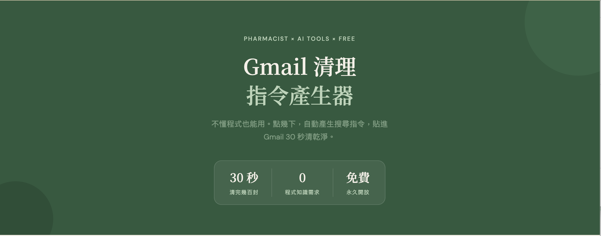

# Gmail Search Builder / Gmail 搜尋指令產生器

> Zero API. Zero login. Just paste and clean.
>
> 零 API、零登入。點幾下產生指令，貼進 Gmail 30 秒清乾淨。

**[👉 Try it now / 立即使用](https://moreshop07.github.io/gmail-search-builder/)**

---

## What is this? / 這是什麼？

A simple, single-page tool that generates Gmail search queries so you can bulk-delete unwanted emails in seconds — no coding, no API keys, no OAuth login required.

一個單頁工具，幫你自動產生 Gmail 搜尋語法，讓你不用寫程式就能批量清理信箱裡的廣告信、通知信、訂閱信。

## Features / 功能

- **Sender / Subject filter** — Filter by sender keywords or subject (supports multiple, comma-separated)
- **Category select** — Promotions, Purchases, Social, Updates, Forums
- **Time range** — Delete emails older than 1 day to 1 year, or all
- **Exclude keywords** — Protect important emails (orders, invoices, collaborations)
- **One-click copy** — Copy the generated query and paste into Gmail
- **Open in Gmail** — Directly open Gmail search with the generated query
- **Step-by-step guide** — Visual tutorial with Gmail UI mockups

---

- **寄件人 / 主旨篩選** — 支援多個關鍵字（逗號分隔）
- **信件分類** — 促銷廣告、購物訂單、社群通知、系統更新、論壇通知
- **刪除範圍** — 1 天前 ~ 1 年前，或全部刪除
- **排除保護** — 保留訂單、發票、合作邀約等重要信件
- **一鍵複製** — 複製搜尋指令，貼進 Gmail 搜尋欄
- **直接開啟 Gmail** — 自動帶入搜尋語法
- **圖文教學** — 附 Gmail 畫面示意的 5 步驟教學

## Screenshot / 截圖

<!-- TODO: Add screenshot -->

## Usage / 使用方式

1. Open `index.html` in any browser / 用瀏覽器打開 `index.html`
2. Fill in sender, category, time range / 填入寄件人、分類、時間範圍
3. Click "Copy" and paste into Gmail search bar / 點「複製指令」貼進 Gmail
4. Follow the on-screen guide to create a filter and bulk-delete / 照畫面教學建立篩選器，一次刪光

No server, no build step, no dependencies. Just one HTML file.

不需要伺服器、不需要編譯、零依賴。只有一個 HTML 檔。

## Live Demo / 線上版

- **GitHub Pages**: [moreshop07.github.io/gmail-search-builder](https://moreshop07.github.io/gmail-search-builder/)
- **Moresie**: [moresie.com/tools/gmail-cleaner](https://moresie.com/tools/gmail-cleaner/)

## Author / 作者

**張藥師（張菁月）** — Pharmacist x AI Tool Developer

- Website: [moresie.com](https://moresie.com)
- GitHub: [@chinwawa07](https://github.com/chinwawa07)
- Free AI Community: [Skool — 藥師的 AI 社群](https://www.skool.com/pharmacist-ai-beginner-lab-7642)

## License

[MIT](LICENSE) &copy; 2025 Moresie 張菁月
